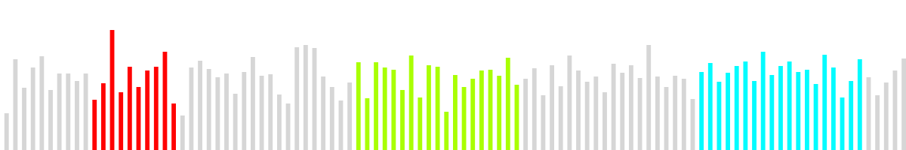
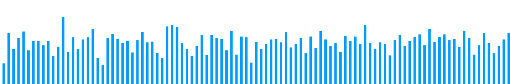

PHP Waveform2PNG Library
===

### About

Generates PNG waveform images for a given MP3 file by converting it to WAV and processing amplitude points and plotting them on a GD canvas.

New functional, fixes, OOP by [Ruslan Slinkov](http://github.com/slruslan).  
Original code by [Andrew Freiday](http://andrewfreiday.com).

### Requirements

- PHP 5.4+
- LAME MP3 Encoder bundle
- Web server (Apache, etc -- unless modified to run as a command line script)

### Installation

- Copy to a location on your web server
- Ensure that the 'lame' command is accessible and executable from that directory (for Windows systems, place the downloaded .exe and .dll as linked above into that same directory, or modify the script)
- Ensure the directory support write persmissions, or specify an alternate temporary output directory that does - 
- Include library.php in your script.

### Library usage

- Include library in your script:
> include "library.php";

- Initialize new instance of Waveform2Png class:
> $graph = new Waveform2Png();

- Change the settings (or leave them default):
> $graph->setHeight(200);
> $graph->setWidth(1200);
> $graph->setBackground('');
> $graph->setForeground('#35cc32');
> $graph->setDetail(20);
> $graph->setType('waveform');

- Load your file and process it:
> $graph->loadFile("test.mp3");
> $graph->process();

- Output image to browser or save it to file:
> $graph->saveImage('waveform_example.png'); // Saves image to file
> $graph->outputImage(); // Outputs image to browser

### Image generation options

Main settings are specified with methods 

- setHeight($height) - Sets output graph height to $height;
- setWidth($width) - Sets output graph width to $width;
- setBackground($hex) - Sets output background color to $hex (or transparent if $hex empty);
- setForeground($hex) - Sets output foreground color to $hex;
- setDefail($amount) - Sets detalization level to $amount. (The lower the number, the less data points are skipped, thus resulting in higher detail waveform);
- setType($type) - Sets graph type to $type;

There is also a method to create graph with different color regions:

- addColor($timeMin, $timeMax, $color) - Sets color of graph to $color on region from $timeMin to $timeMax secs. Example:

### Available graph types

##### Waveform:

##### Bars:

### Other notes

Library is currently under development.

Feel free to submit your suggestions and use issue tracker if you've found a bug.

### License

Please see the LICENSE file.